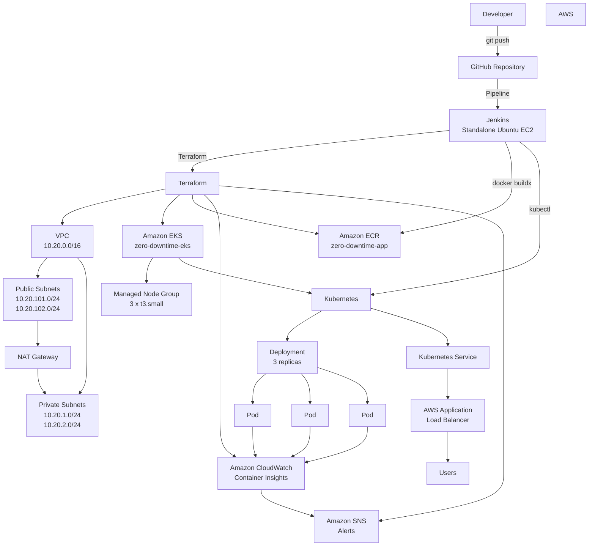

# Zero-Downtime Kubernetes Deployment with Jenkins on AWS EKS

A production-style DevOps project demonstrating how to build, provision, secure, monitor, test, and continuously deploy a containerized application to Amazon EKS using **Terraform, Jenkins, Docker/BuildKit, Amazon ECR, Kubernetes, and AWS Application Load Balancer**.

The primary objective of this project is to implement a realistic Kubernetes deployment pipeline where application releases happen with **zero service interruption**, while failed releases are detected and automatically rolled back.

---

## 1. Project Overview

The project starts with a simple Flask application and builds a complete AWS-based deployment platform around it.

The final workflow is:

```text
Developer
    |
    | git push
    v
GitHub
    |
    | Jenkins Pipeline
    v
Standalone Jenkins EC2
    |
    +--> Unit Tests
    |
    +--> Docker / BuildKit
    |
    +--> Trivy Security Scan
    |
    +--> Amazon ECR
    |       |
    |       +--> ECR Image Scan
    |
    +--> kubectl
            |
            v
       Amazon EKS
            |
            v
     Kubernetes Deployment
            |
            v
      Kubernetes Service
            |
            v
       AWS ALB
            |
            v
          Users
```

The infrastructure itself is provisioned using Terraform.

Therefore, there are two major automation paths:

### Infrastructure path

```text
Terraform
   |
   +--> VPC
   +--> Subnets
   +--> NAT Gateway
   +--> EKS
   +--> Managed Node Group
   +--> EKS Add-ons
   +--> IAM
   +--> CloudWatch
   +--> SNS
   +--> ECR
```

### Application delivery path

```text
GitHub
   |
   v
Jenkins
   |
   +--> Unit Tests
   +--> BuildKit
   +--> Trivy
   +--> ECR
   +--> ECR Scan
   +--> Kubernetes Deployment
   +--> Rollout Verification
   +--> ALB Health Verification
   |
   +--> Automatic Rollback on Failure
```

---

# 2. What Problem Were We Trying to Solve?

A traditional deployment might look like:

```text
Stop old application
        |
        v
Deploy new application
        |
        v
Start new application
```

During this process, users can receive:

```text
HTTP 502
HTTP 503
Connection refused
Timeouts
```

The objective of this project was to eliminate that deployment interruption.

We wanted a deployment system where:

1. A new application version can be released while the old version is still serving traffic.
2. Kubernetes only sends traffic to healthy pods.
3. Existing pods are not terminated before replacement pods become ready.
4. Application failures are detected automatically.
5. A failed deployment can be rolled back automatically.
6. The rollback itself is verified.
7. The external ALB endpoint is tested after deployment.
8. Container images are security-scanned before deployment.
9. Infrastructure is reproducible using Terraform.
10. The entire application deployment is automated through Jenkins.

---

# 3. Final Architecture



---

# 4. AWS Architecture

The project uses:

| Component | Configuration |
|---|---|
| AWS Region | `ap-south-1` |
| VPC | `10.20.0.0/16` |
| Public Subnets | `10.20.101.0/24`, `10.20.102.0/24` |
| Private Subnets | `10.20.1.0/24`, `10.20.2.0/24` |
| NAT Gateway | 1 |
| EKS | `zero-downtime-eks` |
| Kubernetes | 1.36 |
| Worker Nodes | 3 x `t3.small` |
| Node Disk | 20 GB |
| Capacity | ON_DEMAND |
| Container Registry | Amazon ECR |
| Load Balancer | AWS Application Load Balancer |
| Monitoring | CloudWatch Container Insights |
| Notifications | Amazon SNS |

---

# 5. Technology Stack

## Infrastructure

- AWS
- Terraform
- Amazon VPC
- Amazon EKS
- IAM
- NAT Gateway
- Amazon ECR
- CloudWatch
- SNS

## CI/CD

- Jenkins
- GitHub
- Docker
- Docker BuildKit / Buildx
- Trivy
- AWS CLI
- kubectl

## Application

- Python 3.12
- Flask
- unittest

## Kubernetes

- Deployment
- Service
- Ingress
- PodDisruptionBudget
- RollingUpdate
- Readiness Probe
- Liveness Probe
- Startup Probe
- Resource Requests/Limits
- Security Context
- Topology Spread Constraints

---

# 6. Project Phases

The project was implemented in exactly **10 phases**.

---

## Phase 1 — Infrastructure

Terraform was used to create the AWS foundation.

Implemented:

- VPC
- Public subnets
- Private subnets
- Internet Gateway
- NAT Gateway
- Routing
- Availability-zone distribution
- Resource tagging

The VPC uses:

```text
10.20.0.0/16
```

Private subnets:

```text
10.20.1.0/24
10.20.2.0/24
```

Public subnets:

```text
10.20.101.0/24
10.20.102.0/24
```

Terraform module:

```text
terraform-aws-modules/vpc/aws
```

Version:

```text
6.7.3
```

---

# Phase 2 — Amazon EKS

An Amazon EKS cluster was created using Terraform.

Cluster:

```text
zero-downtime-eks
```

Kubernetes:

```text
1.36
```

The cluster uses private subnets for the worker nodes.

The EKS managed node group uses:

```text
Instance type: t3.small
Desired:       3
Minimum:       2
Maximum:       3
Disk:          20 GB
Capacity:      ON_DEMAND
```

EKS add-ons include:

- VPC CNI
- kube-proxy
- CoreDNS
- EKS Pod Identity Agent
- Amazon CloudWatch Observability

Terraform EKS module:

```text
terraform-aws-modules/eks/aws
```

Version:

```text
21.26.0
```

---

# Phase 3 — Kubernetes Application

A simple Flask application was containerized and deployed to Kubernetes.

Application endpoints:

```text
/
 /health
 /ready
```

`/health` is used for liveness/startup validation.

`/ready` determines whether Kubernetes should send traffic to the pod.

The application exposes version information using:

```text
APP_VERSION
```

This allows deployment versions to be easily identified.

Example:

```text
Application Version: 38
```

---

# Phase 4 — AWS ALB / Networking

The Kubernetes application is exposed externally through an AWS Application Load Balancer.

Traffic flow:

```text
Internet
   |
   v
AWS ALB
   |
   v
Kubernetes Service
   |
   v
Application Pods
```

The ALB performs health checks against:

```text
/health
```

Expected response:

```text
HTTP 200
```

The ALB uses IP targets corresponding to the Kubernetes application pods.

---

# Phase 5 — Zero-Downtime Rolling Deployment

This is the core of the project.

The Kubernetes Deployment uses:

```yaml
strategy:
  type: RollingUpdate
  rollingUpdate:
    maxUnavailable: 0
    maxSurge: 1
```

This means Kubernetes must not intentionally reduce the number of available application replicas during an update.

The application runs:

```text
3 replicas
```

During an update:

```text
Old:

Pod A v37
Pod B v37
Pod C v37
```

Kubernetes starts a replacement:

```text
Pod A v37
Pod B v37
Pod C v37
Pod D v38
```

Once the new pod becomes ready:

```text
Pod A v37
Pod B v37
Pod C v37
Pod D v38 READY
```

Kubernetes can then terminate an old pod.

Eventually:

```text
Pod D v38
Pod E v38
Pod F v38
```

This prevents the deployment from intentionally dropping below the required available replica count.

---

# Phase 6 — Jenkins CI/CD

A dedicated Ubuntu EC2 instance was created for Jenkins.

Jenkins is **not running inside the EKS cluster**.

Architecture:

```text
Jenkins
  |
  +--> Terraform
  |
  +--> Docker
  |
  +--> AWS CLI
  |
  +--> kubectl
  |
  +--> Trivy
  |
  +--> ECR
  |
  +--> EKS
```

Jenkins performs both:

### Infrastructure operations

```text
Terraform init
Terraform validate
Terraform plan
Terraform apply
```

### Application delivery

```text
Checkout
   ↓
Python environment
   ↓
Unit tests
   ↓
Docker BuildKit
   ↓
Trivy
   ↓
ECR
   ↓
ECR scan
   ↓
Kubernetes deployment
   ↓
Rollout verification
   ↓
ALB validation
```

---

# Phase 7 — Automated Rollback

The pipeline captures the currently deployed image before changing the Deployment.

Example:

```text
Current version:
:37
```

New version:

```text
:38
```

If the new deployment fails readiness or rollout validation:

```text
Deployment :38
      |
      X
      |
Automatic rollback
      |
      v
Deployment :37
```

The pipeline then verifies:

1. Kubernetes rollout succeeded.
2. The expected previous image is restored.
3. The Deployment has ready replicas.
4. The ALB health endpoint returns HTTP 200.

The rollback mechanism was deliberately tested using a deployment with:

```text
READINESS_FAIL=true
```

The failed release was automatically rolled back to the previous healthy image.

---

# Phase 8 — Production Hardening

The Kubernetes workload was hardened using several production-oriented controls.

## Resource management

CPU and memory requests/limits were configured.

Example:

```text
Requests:
CPU    100m
Memory 128Mi

Limits:
CPU    250m
Memory 256Mi
```

## Pod Disruption Budget

```yaml
minAvailable: 2
```

This protects availability during voluntary disruptions.

## Topology spread

Pods are distributed across Kubernetes nodes using:

```text
kubernetes.io/hostname
```

This reduces the risk of placing all application replicas on the same node.

## Graceful termination

A pre-stop hook is used:

```text
sleep 10
```

and:

```text
terminationGracePeriodSeconds: 30
```

This gives existing connections time to drain during termination.

## Container security

The application container runs:

```text
runAsNonRoot: true
allowPrivilegeEscalation: false
readOnlyRootFilesystem: true
capabilities:
  drop:
    - ALL
seccompProfile:
  type: RuntimeDefault
```

A writable temporary filesystem is provided through:

```text
emptyDir
```

mounted at:

```text
/tmp
```

---

# Phase 9 — Failure and Rollback Testing

The deployment pipeline was tested under both successful and failed conditions.

Tests included:

### Successful deployment

```text
Build
 ↓
Test
 ↓
Scan
 ↓
Push
 ↓
Deploy
 ↓
Rollout successful
 ↓
ALB HTTP 200
```

### Failed readiness

The application was intentionally configured to fail readiness.

Result:

```text
New deployment
      ↓
Readiness failure
      ↓
Rollout timeout
      ↓
Automatic rollback
      ↓
Previous image restored
      ↓
ALB HTTP 200
```

This demonstrated that the rollback mechanism was not merely theoretical.

---

# Phase 10 — Security & CI/CD Hardening

The final phase focused on securing and hardening the image build pipeline.

## BuildKit

Docker builds were migrated to Docker Buildx/BuildKit.

The pipeline uses:

```bash
docker buildx build \
  --build-arg APP_VERSION="${BUILD_NUMBER}" \
  --tag "${IMAGE_NAME}" \
  --provenance=false \
  --load \
  app/
```

`--provenance=false` was used because the generated provenance metadata interfered with the ECR scan workflow used by this project.

## Trivy

Trivy performs a blocking HIGH/CRITICAL vulnerability scan before the image is pushed.

```bash
trivy image \
  --scanners vuln \
  --severity HIGH,CRITICAL \
  --ignore-unfixed \
  --exit-code 1 \
  --no-progress \
  "${IMAGE_NAME}"
```

Therefore:

```text
HIGH/CRITICAL vulnerability
        |
        v
Pipeline FAILS
        |
        X
No deployment
```

## Amazon ECR scanning

ECR scanning is also enabled and verified by Jenkins.

ECR scanning is treated as a reporting layer, while Trivy remains the blocking CI security gate.

The Jenkins pipeline waits for asynchronous ECR scan results and reports:

```text
HIGH
CRITICAL
Finding
Package
Description
```

## Base-image hardening

During Phase 10, an ECR HIGH vulnerability was investigated.

The vulnerable dependency was associated with the Debian-based Python image.

The production image was migrated to:

```text
python:3.12-alpine
```

and the Alpine `zlib` package was explicitly upgraded during the build.

The resulting image passed the blocking Trivy scan with:

```text
HIGH     : 0
CRITICAL : 0
```

---

# 7. Final CI/CD Pipeline

The final Jenkins pipeline is approximately:

```text
┌─────────────────────┐
│      GitHub         │
└──────────┬──────────┘
           │
           ▼
┌─────────────────────┐
│       Checkout      │
└──────────┬──────────┘
           ▼
┌─────────────────────┐
│ Python Environment   │
└──────────┬──────────┘
           ▼
┌─────────────────────┐
│     Unit Tests       │
└──────────┬──────────┘
           │ PASS
           ▼
┌─────────────────────┐
│ Docker BuildKit      │
└──────────┬──────────┘
           ▼
┌─────────────────────┐
│       Trivy          │
│ HIGH/CRITICAL Gate   │
└──────────┬──────────┘
           │ PASS
           ▼
┌─────────────────────┐
│       ECR Push       │
└──────────┬──────────┘
           ▼
┌─────────────────────┐
│    ECR Scan Check    │
└──────────┬──────────┘
           ▼
┌─────────────────────┐
│ Capture Previous     │
│ Deployment Image     │
└──────────┬──────────┘
           ▼
┌─────────────────────┐
│ Kubernetes Deploy    │
└──────────┬──────────┘
           │
           ├─────────────── FAIL ──────────────┐
           │                                   │
           ▼                                   ▼
┌─────────────────────┐              ┌──────────────────┐
│ Rollout Verification│              │ Automatic        │
└──────────┬──────────┘              │ Rollback         │
           │                         └────────┬─────────┘
           │ PASS                             │
           ▼                                  ▼
┌─────────────────────┐              ┌──────────────────┐
│ ALB /health Check   │              │ Verify Previous  │
└──────────┬──────────┘              │ Version + ALB    │
           │                         └──────────────────┘
           ▼
┌─────────────────────┐
│ Deployment SUCCESS   │
└─────────────────────┘
```

---

# 8. Repository Structure

```text
zero-downtime-k8s/
│
├── app/
│   ├── Dockerfile
│   ├── app.py
│   ├── requirements.txt
│   └── test_app.py
│
├── k8s/
│   ├── deployment.yaml
│   ├── ingress.yaml
│   ├── pdb.yaml
│   └── service.yaml
│
├── terraform/
│   ├── ecr.tf
│   ├── eks.tf
│   ├── outputs.tf
│   ├── variables.tf
│   ├── versions.tf
│   ├── vpc.tf
│   ├── cloudwatch_alarms.tf
│   ├── cloudwatch_iam.tf
│   ├── cloudwatch_logs.tf
│   └── cloudwatch_notifications.tf
│
├── Jenkinsfile
├── iam_policy.json
├── .gitignore
└── README.md
```

---

# 9. Prerequisites

The following are required.

## AWS

An AWS account with permissions to create:

- VPC
- EC2
- EKS
- IAM
- ECR
- ALB
- CloudWatch
- SNS
- NAT Gateway

The project was implemented in:

```text
ap-south-1
```

---

# 10. Required Local Tools

Install:

```text
Git
AWS CLI v2
Terraform
kubectl
Docker
Docker Buildx
Python 3
```

For the Jenkins EC2, additionally install:

```text
Jenkins
Trivy
```

---

# 11. Ubuntu Jenkins EC2 Setup

Jenkins runs on a **standalone Ubuntu EC2 instance**.

The EC2 instance acts as the CI/CD controller/worker used by the project.

Recommended architecture:

```text
Internet
   |
   v
Jenkins Ubuntu EC2
   |
   +--> GitHub
   +--> AWS
   +--> Docker
   +--> Terraform
   +--> kubectl
   +--> ECR
   +--> EKS
```

Do not run Jenkins inside the application EKS cluster for this implementation.

---

# 12. Install Base Packages on Jenkins EC2

```bash
sudo apt update

sudo apt install -y \
  git \
  curl \
  unzip \
  wget \
  jq \
  python3 \
  python3-venv \
  python3-pip \
  ca-certificates \
  gnupg \
  lsb-release
```

Verify:

```bash
git --version
python3 --version
curl --version
```

---

# 13. Install Java

Jenkins requires Java.

Install Java 17:

```bash
sudo apt update

sudo apt install -y openjdk-17-jdk
```

Verify:

```bash
java -version
```

---

# 14. Install Jenkins

Add the Jenkins repository:

```bash
sudo wget -O /etc/apt/keyrings/jenkins-keyring.asc \
  https://pkg.jenkins.io/debian-stable/jenkins.io-2026.key

echo "deb [signed-by=/etc/apt/keyrings/jenkins-keyring.asc] \
https://pkg.jenkins.io/debian-stable binary/" \
| sudo tee /etc/apt/sources.list.d/jenkins.list > /dev/null
```

Install:

```bash
sudo apt update
sudo apt install -y jenkins
```

Enable Jenkins:

```bash
sudo systemctl enable jenkins
sudo systemctl start jenkins
```

Check:

```bash
sudo systemctl status jenkins
```

Retrieve the initial password:

```bash
sudo cat /var/lib/jenkins/secrets/initialAdminPassword
```

Access:

```text
http://<JENKINS_EC2_PUBLIC_IP>:8080
```

Restrict port `8080` in the EC2 security group rather than exposing Jenkins broadly to the internet.

---

# 15. Install Docker

Install Docker using the official Docker repository.

```bash
sudo apt update

sudo apt install -y \
  ca-certificates \
  curl \
  gnupg
```

```bash
sudo install -m 0755 -d /etc/apt/keyrings

curl -fsSL https://download.docker.com/linux/ubuntu/gpg \
  | sudo gpg --dearmor -o /etc/apt/keyrings/docker.gpg

sudo chmod a+r /etc/apt/keyrings/docker.gpg
```

```bash
echo \
  "deb [arch=$(dpkg --print-architecture) \
  signed-by=/etc/apt/keyrings/docker.gpg] \
  https://download.docker.com/linux/ubuntu \
  $(. /etc/os-release && echo "$VERSION_CODENAME") stable" \
  | sudo tee /etc/apt/sources.list.d/docker.list > /dev/null
```

Install:

```bash
sudo apt update

sudo apt install -y \
  docker-ce \
  docker-ce-cli \
  containerd.io \
  docker-buildx-plugin \
  docker-compose-plugin
```

Enable Docker:

```bash
sudo systemctl enable docker
sudo systemctl start docker
```

Allow Jenkins to use Docker:

```bash
sudo usermod -aG docker jenkins
```

Restart Jenkins:

```bash
sudo systemctl restart jenkins
```

Verify:

```bash
docker --version
docker buildx version
```

---

# 16. Install AWS CLI v2

```bash
cd /tmp

curl "https://awscli.amazonaws.com/awscli-exe-linux-x86_64.zip" \
  -o "awscliv2.zip"

unzip -q awscliv2.zip

sudo ./aws/install
```

Verify:

```bash
aws --version
```

---

# 17. Install Terraform

The project was built with Terraform:

```text
1.16.5
```

Install the required Terraform version:

```bash
wget https://releases.hashicorp.com/terraform/1.16.5/terraform_1.16.5_linux_amd64.zip \
  -O /tmp/terraform.zip

unzip -o /tmp/terraform.zip -d /tmp/terraform

sudo install /tmp/terraform/terraform /usr/local/bin/terraform
```

Verify:

```bash
terraform version
```

---

# 18. Install kubectl

Install the Kubernetes CLI appropriate for the EKS version being used.

Example:

```bash
curl -LO "https://dl.k8s.io/release/$(curl -L -s https://dl.k8s.io/release/stable.txt)/bin/linux/amd64/kubectl"

sudo install -o root -g root -m 0755 kubectl /usr/local/bin/kubectl
```

Verify:

```bash
kubectl version --client
```

---

# 19. Install Trivy

```bash
sudo apt-get install -y wget gnupg

wget -qO - https://aquasecurity.github.io/trivy-repo/deb/public.key \
  | gpg --dearmor \
  | sudo tee /usr/share/keyrings/trivy.gpg > /dev/null
```

```bash
echo "deb [signed-by=/usr/share/keyrings/trivy.gpg] \
https://aquasecurity.github.io/trivy-repo/deb \
generic main" \
| sudo tee /etc/apt/sources.list.d/trivy.list
```

```bash
sudo apt update
sudo apt install -y trivy
```

Verify:

```bash
trivy --version
```

---

# 20. Verify Jenkins Toolchain

Run:

```bash
sudo -u jenkins git --version
sudo -u jenkins python3 --version
sudo -u jenkins aws --version
sudo -u jenkins terraform version
sudo -u jenkins kubectl version --client
sudo -u jenkins docker --version
sudo -u jenkins docker buildx version
sudo -u jenkins trivy --version
```

All tools must be accessible to the Jenkins user.

---

# 21. Jenkins EC2 IAM Permissions

The Jenkins EC2 should use an **IAM instance profile/role** instead of storing long-lived AWS access keys on the server.

The Jenkins role needs permissions appropriate for:

### ECR

```text
Authenticate
Push images
Describe images
Describe scan findings
```

### EKS

```text
DescribeCluster
```

and appropriate Kubernetes access must be granted to the Jenkins IAM principal.

### Terraform

Terraform also needs permissions required to create/update the AWS resources defined in:

```text
terraform/
```

Do not place:

```text
AWS_ACCESS_KEY_ID
AWS_SECRET_ACCESS_KEY
```

directly in the repository.

---

# 22. Clone the Repository

On the Jenkins EC2:

```bash
cd /home/ubuntu

git clone https://github.com/rahulsharma-rks/zero-downtime-k8s.git

cd zero-downtime-k8s
```

Verify:

```bash
git branch
git log -1 --oneline
```

---

# 23. Configure AWS

If using an EC2 instance profile:

```bash
aws sts get-caller-identity
```

Expected output should identify the Jenkins EC2 IAM role/account.

Verify the region:

```bash
aws configure get region
```

Set the project region if required:

```bash
export AWS_REGION=ap-south-1
export AWS_DEFAULT_REGION=ap-south-1
```

---

# 24. Provision Infrastructure Using Terraform

Move into Terraform:

```bash
cd /home/ubuntu/zero-downtime-k8s/terraform
```

Initialize:

```bash
terraform init
```

Format:

```bash
terraform fmt
```

Validate:

```bash
terraform validate
```

Create a plan:

```bash
terraform plan
```

Apply:

```bash
terraform apply
```

Review the plan carefully before confirming.

---

# 25. Configure the CloudWatch Alert Email

The Terraform configuration contains:

```hcl
variable "alert_email" {
  description = "Email address for CloudWatch alarm notifications"
  type        = string
  sensitive   = true
}
```

Create a local `terraform.tfvars`:

```bash
cat > terraform.tfvars <<'EOF'
aws_region  = "ap-south-1"
project_name = "zero-downtime"
cluster_name = "zero-downtime-eks"

alert_email = "YOUR_EMAIL@example.com"
EOF
```

Replace:

```text
YOUR_EMAIL@example.com
```

with the desired notification address.

**Do not commit `terraform.tfvars` if it contains environment-specific values.**

After Terraform creates the SNS subscription, AWS sends a confirmation email.

The email subscription must be confirmed before SNS notifications are delivered.

---

# 26. Configure kubectl for EKS

After the cluster is created:

```bash
aws eks update-kubeconfig \
  --region ap-south-1 \
  --name zero-downtime-eks
```

Verify:

```bash
kubectl get nodes
```

Expected:

```text
3 nodes
```

Check:

```bash
kubectl get nodes -o wide
```

---

# 27. Verify EKS Add-ons

```bash
aws eks list-addons \
  --cluster-name zero-downtime-eks \
  --region ap-south-1
```

Expected add-ons include:

```text
vpc-cni
kube-proxy
coredns
eks-pod-identity-agent
amazon-cloudwatch-observability
```

---

# 28. Deploy Kubernetes Resources Manually

The Jenkins pipeline normally handles application deployment, but the manifests can also be applied manually.

Create the namespace:

```bash
kubectl create namespace zero-downtime \
  --dry-run=client \
  -o yaml | kubectl apply -f -
```

Apply the application resources:

```bash
kubectl apply -f k8s/service.yaml
kubectl apply -f k8s/pdb.yaml
kubectl apply -f k8s/deployment.yaml
kubectl apply -f k8s/ingress.yaml
```

Check:

```bash
kubectl get all -n zero-downtime
```

---

# 29. Check Deployment

```bash
kubectl get deployment \
  zero-downtime-app \
  -n zero-downtime
```

Check pods:

```bash
kubectl get pods \
  -n zero-downtime \
  -o wide
```

Expected:

```text
3/3 Running
```

Check rollout:

```bash
kubectl rollout status \
  deployment/zero-downtime-app \
  -n zero-downtime
```

---

# 30. Check Kubernetes Health

```bash
kubectl get pods -n zero-downtime
```

Then:

```bash
kubectl describe deployment \
  zero-downtime-app \
  -n zero-downtime
```

Check application logs:

```bash
kubectl logs \
  deployment/zero-downtime-app \
  -n zero-downtime
```

---

# 31. Get the ALB Address

```bash
kubectl get ingress \
  -n zero-downtime
```

Or:

```bash
kubectl get ingress \
  -n zero-downtime \
  -o jsonpath='{.status.loadBalancer.ingress[0].hostname}'
```

Store it:

```bash
export ALB_HOST=$(kubectl get ingress \
  -n zero-downtime \
  -o jsonpath='{.status.loadBalancer.ingress[0].hostname}')
```

Test:

```bash
curl http://${ALB_HOST}/health
```

Expected:

```text
OK
```

---

# 32. Jenkins Pipeline Configuration

Create a Jenkins Pipeline job:

```text
Jenkins
  |
  +--> New Item
  |
  +--> zero-downtime-k8s
  |
  +--> Pipeline
```

Configure the repository:

```text
https://github.com/rahulsharma-rks/zero-downtime-k8s.git
```

Pipeline definition:

```text
Pipeline script from SCM
```

SCM:

```text
Git
```

Branch:

```text
*/main
```

Script path:

```text
Jenkinsfile
```

---

# 33. Jenkins Pipeline Stages

The `Jenkinsfile` implements stages similar to:

```text
Checkout
    ↓
Setup Python Environment
    ↓
Unit Tests
    ↓
Docker Build
    ↓
Trivy Security Scan
    ↓
ECR Login
    ↓
Push Image
    ↓
ECR Scan Verification
    ↓
Capture Previous Image
    ↓
Deploy
    ↓
Verify Deployment
```

The pipeline also contains rollback logic.

---

# 34. Unit Tests

The pipeline creates a Python virtual environment and executes:

```bash
.venv/bin/python \
  -m unittest discover \
  -s app \
  -p 'test_*.py' \
  -v
```

The application currently contains tests for:

```text
/
 /health
 /ready
```

---

# 35. Docker Build

The Jenkins pipeline builds using BuildKit:

```bash
docker buildx build \
  --build-arg APP_VERSION="${BUILD_NUMBER}" \
  --tag "${IMAGE_NAME}" \
  --provenance=false \
  --load \
  app/
```

The Jenkins build number becomes the application image version.

Example:

```text
Build #38
      |
      v
ECR image:
zero-downtime-app:38
```

---

# 36. Trivy Security Gate

The pipeline scans the local Docker image before pushing it:

```bash
trivy image \
  --scanners vuln \
  --severity HIGH,CRITICAL \
  --ignore-unfixed \
  --exit-code 1 \
  --no-progress \
  "${IMAGE_NAME}"
```

The important behavior is:

```text
0 HIGH/CRITICAL
       |
       v
Continue
```

while:

```text
HIGH/CRITICAL found
       |
       v
Pipeline FAILURE
       |
       X
No deployment
```

---

# 37. ECR Push

Jenkins authenticates against ECR:

```bash
aws ecr get-login-password \
  --region ap-south-1 \
  | docker login \
      --username AWS \
      --password-stdin \
      520701146276.dkr.ecr.ap-south-1.amazonaws.com
```

The repository is:

```text
zero-downtime-app
```

Images are tagged using Jenkins build numbers.

Example:

```text
520701146276.dkr.ecr.ap-south-1.amazonaws.com/zero-downtime-app:38
```

For a different AWS account, replace:

```text
520701146276
```

with your own account ID.

---

# 38. ECR Scan Verification

ECR vulnerability scanning is asynchronous.

Therefore Jenkins does not assume the result is immediately available.

The pipeline polls:

```bash
aws ecr describe-image-scan-findings
```

until results become available.

The pipeline reports:

```text
HIGH
CRITICAL
Finding
Package
Description
```

ECR scanning is currently **report-only**.

The blocking security gate is Trivy.

---

# 39. Kubernetes Deployment from Jenkins

The pipeline updates:

```text
deployment/zero-downtime-app
```

with the new ECR image.

The Kubernetes container name is:

```text
app
```

Example:

```bash
kubectl set image \
  deployment/zero-downtime-app \
  app=<ECR_IMAGE>:<BUILD_NUMBER> \
  -n zero-downtime
```

Then Jenkins waits for:

```bash
kubectl rollout status
```

---

# 40. Automatic Rollback

If rollout verification fails, Jenkins performs a deterministic rollback.

Conceptually:

```text
Previous image
      |
      v
:37

New image
      |
      v
:38
      |
      X
Readiness failure
      |
      v
Restore :37
```

The pipeline verifies the rollback rather than simply issuing the rollback command and assuming it worked.

---

# 41. Manual Rollback

A Kubernetes rollback can also be performed manually.

View rollout history:

```bash
kubectl rollout history \
  deployment/zero-downtime-app \
  -n zero-downtime
```

Rollback:

```bash
kubectl rollout undo \
  deployment/zero-downtime-app \
  -n zero-downtime
```

Wait:

```bash
kubectl rollout status \
  deployment/zero-downtime-app \
  -n zero-downtime
```

Verify:

```bash
kubectl get deployment \
  zero-downtime-app \
  -n zero-downtime \
  -o jsonpath='{.spec.template.spec.containers[0].image}'
```

---

# 42. Monitoring

Amazon CloudWatch Container Insights is enabled for EKS.

The project creates CloudWatch log groups for:

```text
application
dataplane
host
performance
```

Retention:

```text
14 days
```

CloudWatch alarms include:

### Application CPU

Triggers when application CPU utilization exceeds:

```text
80%
```

for:

```text
3 consecutive minutes
```

### Application memory

Triggers when application memory utilization exceeds:

```text
80%
```

for:

```text
3 consecutive minutes
```

### Container restarts

Triggers when application container restart count is:

```text
>= 1
```

### ALB target 5xx

Triggers when the application ALB target returns:

```text
>= 1 HTTP 5xx
```

The alarms publish notifications to:

```text
Amazon SNS
```

---

# 43. Useful Kubernetes Commands

Get everything:

```bash
kubectl get all -n zero-downtime
```

Pods:

```bash
kubectl get pods -n zero-downtime -o wide
```

Deployment:

```bash
kubectl get deployment -n zero-downtime
```

Services:

```bash
kubectl get svc -n zero-downtime
```

Ingress:

```bash
kubectl get ingress -n zero-downtime
```

PDB:

```bash
kubectl get pdb -n zero-downtime
```

Deployment image:

```bash
kubectl get deployment zero-downtime-app \
  -n zero-downtime \
  -o jsonpath='{.spec.template.spec.containers[0].image}'
```

Rollout:

```bash
kubectl rollout status \
  deployment/zero-downtime-app \
  -n zero-downtime
```

Deployment history:

```bash
kubectl rollout history \
  deployment/zero-downtime-app \
  -n zero-downtime
```

Logs:

```bash
kubectl logs \
  deployment/zero-downtime-app \
  -n zero-downtime
```

---

# 44. Useful AWS Commands

Check identity:

```bash
aws sts get-caller-identity
```

EKS:

```bash
aws eks describe-cluster \
  --name zero-downtime-eks \
  --region ap-south-1
```

Nodes:

```bash
kubectl get nodes -o wide
```

ECR:

```bash
aws ecr describe-repositories \
  --repository-names zero-downtime-app \
  --region ap-south-1
```

List ECR images:

```bash
aws ecr describe-images \
  --repository-name zero-downtime-app \
  --region ap-south-1
```

EKS add-ons:

```bash
aws eks list-addons \
  --cluster-name zero-downtime-eks \
  --region ap-south-1
```

---

# 45. Terraform Commands

Initialize:

```bash
terraform init
```

Format:

```bash
terraform fmt
```

Validate:

```bash
terraform validate
```

Plan:

```bash
terraform plan
```

Apply:

```bash
terraform apply
```

Destroy:

```bash
terraform destroy
```

**Warning:** `terraform destroy` removes the infrastructure created by the project. Review the plan carefully before confirming.

---

# 46. Reproducing the Complete Project

The recommended replication sequence is:

## Step 1 — Clone

```bash
git clone https://github.com/rahulsharma-rks/zero-downtime-k8s.git

cd zero-downtime-k8s
```

## Step 2 — Configure AWS

```bash
aws sts get-caller-identity
```

## Step 3 — Configure Terraform variables

```bash
cd terraform
```

Create:

```text
terraform.tfvars
```

with your environment-specific configuration:

```hcl
aws_region   = "ap-south-1"
project_name = "zero-downtime"
cluster_name = "zero-downtime-eks"

alert_email = "YOUR_EMAIL@example.com"
```

## Step 4 — Provision AWS

```bash
terraform init
terraform fmt
terraform validate
terraform plan
terraform apply
```

## Step 5 — Configure kubectl

```bash
aws eks update-kubeconfig \
  --region ap-south-1 \
  --name zero-downtime-eks
```

## Step 6 — Verify cluster

```bash
kubectl get nodes
```

## Step 7 — Configure Jenkins

Install:

```text
Jenkins
Java
Git
Docker
Docker Buildx
AWS CLI
Terraform
kubectl
Trivy
Python
```

## Step 8 — Configure Jenkins IAM

Use an EC2 instance profile/role with the required AWS permissions.

## Step 9 — Configure Jenkins job

Point Jenkins at:

```text
https://github.com/rahulsharma-rks/zero-downtime-k8s.git
```

Branch:

```text
main
```

Pipeline file:

```text
Jenkinsfile
```

## Step 10 — Run Jenkins

The pipeline performs:

```text
Checkout
→ Unit Tests
→ Docker Build
→ Trivy
→ ECR
→ ECR Scan
→ Kubernetes Deployment
→ Rollout Verification
→ ALB Verification
```

---

# 47. Expected Final State

After successful deployment:

```text
EKS Cluster
└── zero-downtime
    └── Deployment
        ├── Pod 1 - Running
        ├── Pod 2 - Running
        └── Pod 3 - Running
```

All three replicas should be ready:

```text
READY 3/3
```

The application should return:

```bash
curl http://${ALB_HOST}/health
```

Result:

```text
OK
```

The application endpoint:

```bash
curl http://${ALB_HOST}/
```

should display the current application version.

---

# 48. Security Considerations

This project intentionally avoids storing AWS credentials in Git.

Do not commit:

```text
terraform.tfvars
.env
AWS access keys
AWS secret keys
private keys
Jenkins credentials
Kubernetes secrets containing credentials
```

Use:

- IAM instance profiles
- IAM roles
- Jenkins credential management where required
- Kubernetes Secrets / external secret-management solutions for sensitive application data

The `alert_email` Terraform variable is marked sensitive, but the value should still be supplied through an environment-specific mechanism rather than committed to Git.

---

# 49. What This Project Demonstrates

This project demonstrates practical understanding of:

### AWS

- VPC
- Subnets
- NAT Gateway
- EKS
- ECR
- IAM
- ALB
- CloudWatch
- SNS

### Terraform

- Infrastructure as Code
- Terraform modules
- Variables
- Outputs
- IAM resources
- EKS provisioning
- Resource dependencies
- Validation and formatting

### Kubernetes

- Deployments
- Rolling updates
- Services
- Ingress
- Readiness probes
- Liveness probes
- Startup probes
- PodDisruptionBudgets
- Resource limits
- Security contexts
- Graceful termination
- Topology spreading
- Rollbacks

### Jenkins

- Pipeline as Code
- Automated testing
- Docker builds
- Security gates
- ECR integration
- Kubernetes deployments
- Automated rollback
- Deployment verification

### Container Security

- BuildKit
- Trivy
- ECR scanning
- Base-image hardening
- Non-root containers
- Read-only filesystems
- Dropped Linux capabilities

### Observability

- CloudWatch Container Insights
- Kubernetes application metrics
- Container restart monitoring
- ALB 5xx monitoring
- SNS notifications

---

# 50. Important Lessons Learned

The project was intentionally built and tested through failure scenarios rather than only demonstrating a successful deployment.

Important lessons included:

1. **Readiness is critical for zero-downtime deployments.**

   A pod being `Running` does not necessarily mean it is ready to receive production traffic.

2. **`maxUnavailable: 0` alone is not enough.**

   Health probes, graceful termination, capacity, and load-balancer health checks must work together.

3. **Rollback must be deterministic.**

   A pipeline should verify which image was deployed before the change and restore that exact image when possible.

4. **External validation matters.**

   A successful Kubernetes rollout does not automatically prove that users can reach the application.

   Therefore the pipeline also validates the ALB.

5. **Security scanning belongs before deployment.**

   Trivy is therefore a blocking CI gate.

6. **ECR scanning is asynchronous.**

   Jenkins must wait for the scan results instead of assuming they are immediately available.

7. **Container hardening can expose application assumptions.**

   Running as non-root and using a read-only root filesystem forces the application to explicitly handle writable locations such as `/tmp`.

8. **Observability needs to be designed alongside deployment.**

   CloudWatch metrics and alarms provide operational feedback after deployment.

---

# 51. Project Limitations

This project is production-style, but it is not intended to represent a complete enterprise platform.

It does not currently implement:

- Multi-region disaster recovery
- Blue/Green deployment
- Canary deployment
- Database migration automation
- Application authentication
- External secrets management
- Multi-environment promotion such as Dev → Stage → Production
- GitOps with Argo CD
- Service mesh
- Full distributed tracing
- Advanced SLO/SLA management
- Automated DR testing

Those are separate architectural concerns that can be added depending on the production requirements.

---

# 52. Repository

Source code:

**GitHub:** https://github.com/rahulsharma-rks/zero-downtime-k8s

The repository contains the complete Terraform, Kubernetes manifests, application code, Dockerfile, Jenkins pipeline, IAM policy, and CloudWatch configuration required for the project.

---

# 53. Final Architecture Summary

The final system can be summarized as:

```text
                         ┌───────────────┐
                         │   Developer   │
                         └───────┬───────┘
                                 │
                                 │ git push
                                 ▼
                         ┌───────────────┐
                         │    GitHub     │
                         └───────┬───────┘
                                 │
                                 ▼
                  ┌──────────────────────────┐
                  │ Jenkins - Ubuntu EC2     │
                  │                          │
                  │ Unit Tests               │
                  │ Docker BuildKit          │
                  │ Trivy                    │
                  │ ECR                      │
                  │ kubectl                   │
                  │ Terraform                 │
                  └────────────┬─────────────┘
                               │
               ┌───────────────┼────────────────┐
               │               │                │
               ▼               ▼                ▼
          ┌─────────┐      ┌─────────┐    ┌──────────┐
          │   ECR   │      │   EKS   │    │Terraform │
          │ Images  │      │ Cluster │    │  Infra   │
          └─────────┘      └────┬────┘    └──────────┘
                                │
                                ▼
                     ┌────────────────────┐
                     │ Kubernetes         │
                     │ Deployment         │
                     │                    │
                     │  Pod  Pod  Pod     │
                     └─────────┬──────────┘
                               │
                               ▼
                     ┌────────────────────┐
                     │ Kubernetes Service │
                     └─────────┬──────────┘
                               │
                               ▼
                     ┌────────────────────┐
                     │ AWS Application    │
                     │ Load Balancer      │
                     └─────────┬──────────┘
                               │
                               ▼
                            Users


       ┌─────────────────────────────────────────┐
       │              Observability              │
       │                                         │
       │ CloudWatch Container Insights           │
       │ CloudWatch Alarms                       │
       │ SNS Notifications                       │
       └─────────────────────────────────────────┘
```

---

# 54. Final Outcome

The completed implementation provides an automated path from source code to production:

```text
GitHub
  ↓
Jenkins
  ↓
Unit Tests
  ↓
BuildKit
  ↓
Trivy
  ↓
Amazon ECR
  ↓
ECR Scan
  ↓
Amazon EKS
  ↓
Rolling Deployment
  ↓
Readiness Verification
  ↓
ALB Verification
  ↓
Production
```

If the deployment fails:

```text
Failed Release
      ↓
Rollback
      ↓
Previous Healthy Image
      ↓
Rollout Verification
      ↓
ALB Health Verification
```

The result is a reproducible, security-conscious, observable Kubernetes CI/CD implementation with **zero-downtime rolling deployments and automated rollback**.
